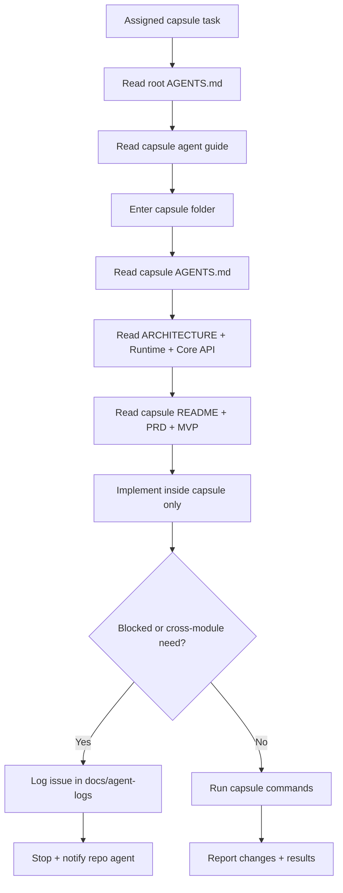

# Verbum Capsule Funneling (Agent Onboarding)

This document is the **single, fast path** for agents working inside a capsule. It exists to keep you siloed, reduce repo‑wide context, and prevent accidental wiring changes.

## Start Here (Capsule Agent Quick Path)
1. Read `AGENTS.md` (root) for global rules and forbidden areas.
2. Read `docs/agents/CAPSULE_AGENT.md` (capsule-specific guide).
3. Go **directly** to your capsule folder (e.g., `modules/features/library/bible`).
4. Read the **nearest `AGENTS.md`** (capsule rules).
5. Read global constraints and contracts:
   - `docs/ARCHITECTURE_MAP.md` (boundaries)
   - `docs/runtime-constitution.md` (performance laws)
   - `docs/contracts/CORE_API.md` (available contracts)
   - `docs/contracts/CONTRACT_INDEX.md` (wiring coverage)
6. Read the capsule docs in this order:
   - `README.md` (scope + constraints)
   - `docs/PRD.md` (what to build)
   - `docs/MVP.md` (what counts as done)
   - `docs/TODO.md` (capsule task list)
   - `docs/agent-logs/README.md` (logging rules)
7. Implement **only inside the capsule**.
8. Log any issues/questions/decisions in the capsule `docs/agent-logs/` (see below).
9. Run the capsule commands listed in its `AGENTS.md`.

## Scope Guardrails (Do / Don’t)
**Do**
- Edit only files **inside your capsule directory**.
- Use contracts in `modules/core/api` or `modules/core/spi` (via the repo agent if needed).
- Keep logic/data **pure**: no Minecraft/Fabric classes in capsules.

**Do Not**
- Touch `assemblies/*` (wiring) or `build-logic/*`.
- Import other feature modules.
- Add simulation loops to feature capsules.
- Change public API contracts without a dedicated contracts PR.
- Search or list files outside your capsule for examples; use `docs/contracts/CORE_API.md` and `docs/contracts/CONTRACT_INDEX.md` instead.

## Stop Conditions (Log + Escalate)
If any of the following occurs, **stop and log it**:
- You need a new API/SPI contract.
- You think a change belongs in `assemblies/*` or `modules/core/*`.
- You discover a performance hot-path issue.
- You are unsure about data/asset placement.

## Issue / Question Logging (Required for Ambiguities)
Create a log entry under:
`<capsule>/docs/agent-logs/YYYY-MM-DD_<type>_<slug>.md`

Allowed `type`: `issue`, `question`, `decision`, `risk`, `todo`

Frontmatter template:
```markdown
---
title: "Short, specific title"
date: YYYY-MM-DD
type: issue|question|decision|risk|todo
status: open|resolved
owner: <agent-id-or-name>
capsule: <domain>/<feature>
related: [paths/you/touched/or/need]
tags: [performance, api, assets, wiring, docs]
---
```

Body template:
```markdown
## Context
## Findings
## Decision / Next Steps
```

## Flow Diagram (Siloed Agent)


## Capability Sweep (Avoid Stop-Start Loops)
Before stopping for a cross-module need, do a **capability sweep**:
1. List every missing API/SPI/assembly hook you anticipate.
2. Log them **together** in a single `agent-logs` entry.
3. Stop and notify the repo agent once.

This prevents multiple stop/restart cycles for one feature.

## Capsule TODO Use
Capsules track their work in `docs/TODO.md`. Update this file as you progress:
- Add tasks you discover while implementing.
- Mark items done when verified.
- Do **not** edit root `TODO.md` (repo agent only).
