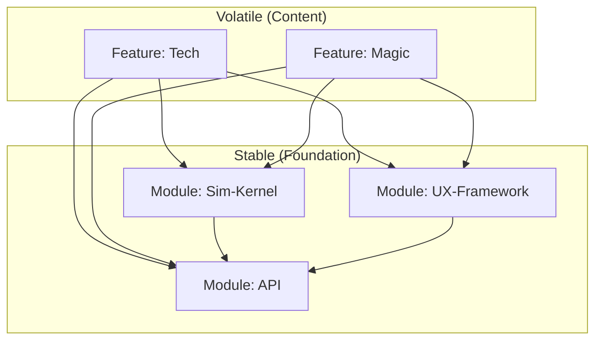

# Verbum Minecraft
[](https://github.com/petalofzion/Verbum_Minecraft/actions/workflows/build.yml)
[](LICENSE)
[](https://openjdk.java.net/)
[](https://fabricmc.net/)
[](https://checkstyle.sourceforge.io/)


> *“In the beginning was the Word…”* — John 1:1


<!-- Dev vs Player Index -->
**Quick Links:** [For Players](#for-players) | [For Developers](#for-developers) | [Architecture](#architecture) | [Contribution Guidelines](#contribution-guidelines)

## ⚡ Mission


Verbum aims to encapsulate the depth of a massive modpack (tech, magic, exploration) into a **single, cohesive codebase**.
We reject the "glue" approach of modpacks. Instead of converting RF to EU or fighting conflicting ores, Verbum uses a **Unified Object Model** (meaning a single canonical material/item/block taxonomy and data schema used across all systems: tech, magic, worldgen) and **Data-Oriented Design** to ensure maximum performance.


### 🌾 Design Ethos
Verbum treats world-simulation like architecture: measured, coherent, and built to last.

While it aims for technical excellence, its hidden blueprint is quiet devotion: to beauty, clarity, and rootedness. Inspired by sacred architecture, monastic rhythm, and the principle of one Word made many systems

Verbum carries a quiet devotional thread; beauty, clarity, and continuity. You can play it purely as an add-on; the meaning is there for those to discover.


### Unified Object Model (Operational Commitments)
- **One taxonomy:** A single canonical registry for materials/items/blocks (no duplicate ingots, dusts, or ores).
- **One schema:** Shared data schemas across systems (tech, magic, worldgen) with explicit versioning + migrations.
- **One simulation contract:** Features register data; the kernel owns the hot loops.
- **One UX language:** Shared UI components + themes to avoid one-off GUI code and asset bloat.

**Our Goal:** 20 TPS at 32-chunk render distance, even with complex automation.

---

### 🛡️ The Data Pledge: We treat save data as sacred.

*   **Backward Compatibility:** We strive to never break existing worlds.
*   **Migration:** Any necessary data schema changes will include automatic "DataFixer" migration scripts.

---

## ✅ Current Status

### Targets (Pinned)
| Component | Target |
|---|---|
| Minecraft | 1.21.11 |
| Loader | Fabric 0.18.4 |
| Fabric API | 0.140.2+1.21.11 |
| Java | 21 |
| Client | ✅ |
| Dedicated Server | ✅ |
| Rendering | Sodium-compatible, Iris-compatible |

### Milestone Progress
- **Current Milestone:** Vertical Slice — “Stone Age”
- **Implemented:** Core API scaffolding (Energy/Fluid), repo build-logic scaffolding
- **Next:** Sim-Kernel batched tick loop + benchmark harness

---

<a id="architecture"></a>
## 🏗️ The "Hardware-Reality" Architecture

This project is not structured like a normal mod. We use a strictly tiered **Modular Monolith** to prevent spaghetti code and enforce performance budgets.

### The Tiered Build: One Repo, Two Editions ("Vanilla+" & "Visions")
Verbum is built as a single codebase that can produce **two editions**:
 
* **Verbum: Vanilla+** — a conservative Vanilla+ experience focused on prayer/book/Bible systems and lightweight quality-of-life improvements. Output: `verbum-vanilla.jar`.
* **Verbum: Visions** — the full total conversion (tech, high magic, dimensions, etc.). **Visions is standalone and includes all Vanilla content**, so players install **either** Vanilla+ **or** Visions (not both). Output: `verbum-visions.jar`.

This split is intentional: it enforces architectural boundaries early, allows the Vanilla edition to remain stable, and lets Visions evolve aggressively without dragging the core into complexity.



*   **`modules/core/api`**: Pure interfaces. No logic. The "Language" of the mod.
*   **`modules/core/spi`**: The Feature Discovery layer. Used for self-registration.
*   **`modules/core/sim-kernel`**: The engine. Optimized, batched logic loops (O(1)).
*   **`modules/<category>/<baseline|visions-only>/`**: Feature modules. Content registration only.
    *   **Baseline** is a content tier included in both editions; it is not an edition itself.

**Assembly wiring:** The `assemblies/*` projects are the only layer that touches Fabric/Minecraft classes, config/IO, and registry wiring. Feature modules stay pure logic/data and are discovered via SPI.

---

## 📦 Project Structure

A brief explanation of the top-level directories:
*   `docs/`: Project documentation, architectural guidelines, decision logs, and clean room logs.
*   `modules/`: The core modular monolith, organized by category (core, tech, magic, world).
*   `assemblies/`: Product distribution projects that bundle specific modules into JARs.
*   `tools/`: Verification layers, including data generation, game tests, and performance benchmarks.
*   `build-logic/`: Custom Gradle convention plugins for enforcing architectural rules.
*   `LICENSES/`: Contains license information for project dependencies.
*   `third_party/`: Used for tracking external code or assets.

---

## ⚖️ The Runtime Constitution

We adhere to 5 non-negotiable laws to maintain performance. See [docs/runtime-constitution.md](docs/runtime-constitution.md) for the full legal text.

1.  **The Allocation Law:** No memory allocation inside the simulation loop (`tick()`).
2.  **The Batching Law:** Machines do not tick themselves; the Kernel ticks them in batches.
3.  **The Invalidation Law:** Never force a chunk rebuild or light update unless visually necessary.
4.  **The Monomorph Law:** Keep hot-path call sites monomorphic (avoid interface polymorphism in tight loops).
5.  **The Clean Room Law:** All implementations must be original or strictly adapted from permissive open source.

---

## 📈 Performance Contract (Verifiable)

Verbum performance targets are enforced by benchmarks and reproducible in-game scenarios.

### Baseline Hardware (for published numbers)
When we publish performance numbers (TPS/FPS), they will reference a declared baseline machine (CPU/GPU/RAM) and JVM flags. Local results will vary.

**Baseline Test Scenario**
- World: `tools/benchmarks/worlds/verbum-bench-seed` (tracked in-repo)
- Workload: N machines + M transport edges + K chunk updates (defined in `tools/benchmarks/README.md`)
- Measurement: median TPS + 1% low frame-time (client) where applicable
- Tools: Spark profiles + in-game TPS capture + kernel JMH suite

**Pass Criteria**
- Median TPS ≥ 20 under the baseline scenario
- No allocation within kernel hot loops (validated by profiling/alloc checks)
- No new regressions beyond defined budgets (CI-gated)

### CI & Benchmark Gating
The Continuous Integration (CI) pipeline, defined in [.github/workflows/build.yml](https://github.com/petalofzion/Verbum_Minecraft/actions/workflows/build.yml), performs the following:
-   **Build Verification:** Ensures the project compiles cleanly.
-   **Code Style Checks:** Enforces consistent coding standards (e.g., Checkstyle).
-   **Unit & Integration Tests:** Runs `./gradlew test` and `./gradlew gametest` (when configured) tasks.
-   **Benchmark Execution:** Executes microbenchmarks (`./gradlew :modules:core:sim-kernel:jmh`) for critical hot paths.
-   **Gating:** Currently, benchmark failures are **advisory**. Once the core `sim-kernel` is stable, benchmark non-regressions will become **mandatory** for merging pull requests.

### Running the Performance Contract Locally (Repro Steps)

1.  **Build + sanity:** `./gradlew build`
2.  **Kernel microbenchmarks (JMH):** `./gradlew :modules:core:sim-kernel:jmh`
3.  **Baseline scenario:** launch a dev instance and load `tools/benchmarks/worlds/verbum-bench-seed`.
4.  **Capture evidence:** record median TPS and (client) 1% low frametime; for regressions include a **spark** profile.
5.  **Declare environment:** CPU/GPU/RAM, OS, Java version, and any JVM flags.

See `tools/benchmarks/README.md` for the exact workload definition and measurement rules.

---

## 🗺️ Roadmap / Vertical Slice Progress

*   [x] Core API (Energy/Fluid)
*   [ ] Sim-Kernel Implementation
*   [ ] "Stone Age" Vertical Slice
*   [ ] Basic Tech Machinery
*   [ ] Elemental Magic System
*   [ ] New World Generation Features
*   [ ] Advanced UX/UI Elements

---

## 🛠️ Tech Stack

Verbum is built on cutting-edge technologies to deliver unparalleled performance and stability:

*   **Fabric Loader:** For a lightweight, performance-oriented modding API.
*   **Fabric API:** Essential utilities and hooks for Fabric mods.
*   **JDK 21:** Leveraging the latest Java features for optimal performance and developer experience.
*   **Sodium-Compatible Rendering:** Designed from the ground up to integrate seamlessly with Sodium and other performance-enhancing rendering mods.
*   **JMH (Java Microbenchmark Harness):** Used for rigorous performance verification of critical code paths. The benchmark harness lives in `tools/benchmarks` and JMH benchmarks for the simulation kernel are located in `:modules:core:sim-kernel:jmh`.
*   **Spark:** For in-depth profiling and identifying performance bottlenecks.
*   **Gradle:** As the build automation tool, utilizing custom [Build Logic](build-logic/) for architectural enforcement.

---

<a id="contribution-guidelines"></a>
## ⚠️ Contributor & Legal Warning

**Strict Clean Room Policy Enforced.**
To protect this project from IP contamination:

*   ❌ **DO NOT** look at or submit decompiled code from closed-source mods.
*   ❌ **DO NOT** submit assets (textures/models) from other games or mods.
*   ✅ **DO** read the [Clean Room Logs](docs/clean-room-logs/README.md) before implementing complex features.
*   ✅ **DO** provide a short checklist for your contributions:
    *   If you adapted permissive code, add entry to `SOURCE_ATTRIBUTION.md` and copy license into `LICENSES/`.
    *   If you created a new subsystem, add an ADR in `docs/ADRS/`.
    *   If you touched a kernel hot loop, add/adjust benchmarks in `tools/benchmarks/`.

---

## ❗ IMPORTANT NOTE FOR AGENTS
All agents **must** start with `AGENTS.md`, then read the appropriate role guide:
- Capsule agents: `docs/agents/CAPSULE_AGENT.md`
- Repo agents: `docs/agents/REPO_AGENT.md`

If you are unsure which role you are:
- Only touching `modules/features/<domain>/<feature>/` → Capsule Agent
- Touching `assemblies/*`, `modules/core/*`, or cross‑module contracts → Repo Agent

If you are assigned a single feature/mod or a contained bugfix, you are likely a Capsule Agent. If you are assigned wiring, integration, or cross‑module changes, you are likely a Repo Agent. If you are unsure, **ask for clarification before proceeding**—do not hunt the repo to decide your role.
*   ✅ **Contribution Declaration:** By contributing, you affirm you did not use decompiled/closed-source mod code or assets as a reference for this contribution.

---

## 🤖 AI Agent Rules (Non-Negotiable)

If you are an AI agent contributing code:

1. Read **docs/ARCHITECTURE_MAP.md** first.
2. **Never** place simulation logic in `modules/<category>/...`.
3. Any change to kernel hot paths requires:
   - a benchmark update (`tools/benchmarks` or JMH), and
   - a short ADR if it changes architecture.
4. If you need cross-feature communication, add contracts in `modules/core/api` (or `modules/core/spi` if internal).
5. Do not import between feature modules. Ever.

---

<a id="for-developers"></a>
## 🚀 Getting Started

### Quickstart (Dev)

```bash
./gradlew build
./gradlew runClient
./gradlew runServer
./gradlew check
./gradlew :modules:core:sim-kernel:jmh
```

---

### Prerequisites

*   **Verbum targets Java 21.**
*   **Git**

### 💻 IDE Setup
**IntelliJ IDEA (Recommended):**
1. Open the project folder as a Gradle Project.
2. Run the IDE Gradle sync; if sources are missing, run `./gradlew genSources` (or the Loom equivalent configured in this repo).
3. Reload the Gradle project.

**VS Code:**
1. Install the "Extension Pack for Java".
2. Run the IDE Gradle sync; if sources are missing, run `./gradlew genSources` (or the Loom equivalent configured in this repo).

### Building & Running

```bash
# Clone the repository
git clone https://github.com/petalofzion/Verbum_Minecraft.git
cd Verbum_Minecraft

# Build (default)
./gradlew build

# Optional: edition-specific artifacts
./gradlew :assemblies:vanilla-plus:build
./gradlew :assemblies:visions:build

# Run the Client (with mixins applied)
./gradlew runClient

# Run the Server (for dedicated server testing)
./gradlew runServer

# Run the Performance Benchmarks
./gradlew :modules:core:sim-kernel:jmh
```

---

## ⚠️ Common Build Issues

*   **Java Version Mismatch:** Ensure JDK 21 is installed and your `JAVA_HOME` environment variable is correctly set.
*   **Gradle Daemon Memory:** If you encounter `OutOfMemoryError` during compilation, try increasing Gradle daemon's memory in `gradle.properties` (e.g., `org.gradle.jvmargs=-Xmx4G`).
*   **IDE Sync Problems:** If your IDE doesn't recognize Gradle modules correctly, try "Reload Gradle Project" or "Invalidate Caches / Restart".

---

## 📚 Documentation Index

*   **[Architecture Map](docs/ARCHITECTURE_MAP.md):** Deep dive into the dependency graph.
*   **[Runtime Constitution](docs/runtime-constitution.md):** Learn about the 5 Laws of Performance that govern this project.
*   **[Contributing Guide](docs/CONTRIBUTING.md):** Guidelines for contributors (human or AI).
*   **[Clean Room Logs](docs/clean-room-logs/README.md):** The paper trail of our design decisions.
*   **[Source Attribution](SOURCE_ATTRIBUTION.md):** Credits for open-source libraries adapted in this project.
*   **[Security Policy](docs/SECURITY.md):** Vulnerability reporting. This is not a cryptography project; report crashes/exploits/dupes/RCE vectors.
*   **[Architecture Decision Records (ADRs)](docs/ADRS/README.md):** Documenting significant architectural decisions.

---

<a id="for-players"></a>
## 🎮 For Players

Verbum is published in **two player-facing editions**:

- **Verbum: Vanilla+** — Vanilla+ (lightweight, conservative).
- **Verbum: Visions** — full total conversion (includes everything from Vanilla).

### Installation
Choose **one** edition to install (do not install both at the same time):

- **Vanilla+:** install `verbum-vanilla-X.X.X.jar`
- **Visions:** install `verbum-visions-X.X.X.jar` (includes all Vanilla content)

1.  **Install Fabric Loader:** Download and run the [Fabric Installer](https://fabricmc.net/use/). Use the **Minecraft** + **Fabric Loader** versions listed in the Targets table above.
2.  **Install Fabric API:** Download the appropriate **Fabric API** version listed in the Targets table and place it in your `mods` folder.
3.  **Download Verbum:** Get the latest release from the [releases page](https://github.com/petalofzion/Verbum_Minecraft/releases) and place **either** `verbum-vanilla-X.X.X.jar` **or** `verbum-visions-X.X.X.jar` in your `mods` folder.

### Usage
*   **Client & Server Support:** Verbum is designed to work seamlessly on both single-player clients and dedicated servers.
*   **Configuration:** Configuration files for Verbum will be located in the `.minecraft/config/verbum/` directory.
*   **Edition Choice:** If you want the smallest footprint and the most conservative gameplay changes, use **Vanilla+**. If you want the full total conversion, use **Visions**.

### ⚙️ Optional Recommended Mods (Performance Stack)

Verbum is built to be **performance-first** and to coexist with the common Fabric optimization ecosystem. These mods are **optional**, but recommended for players/servers chasing maximum FPS/TPS headroom.

**Rule:** always match mod versions to your exact **Minecraft + Fabric Loader** versions (see Targets table above).

#### Core Stack (start here)
- [Sodium](https://modrinth.com/mod/sodium) — [Client] renderer overhaul (big FPS + stutter reduction)
- [Lithium](https://modrinth.com/mod/lithium) — [Both] general-purpose game logic optimizations
- [FerriteCore](https://modrinth.com/mod/ferrite-core) — [Both] lowers memory usage / GC pressure
- [ModernFix](https://modrinth.com/mod/modernfix) — [Both] broad performance + memory + bugfix bundle
- [Memory Leak Fix](https://modrinth.com/mod/memoryleakfix) — [Both] fixes multiple known memory leaks
- [Krypton](https://modrinth.com/mod/krypton) — [Server] networking stack optimizations

#### Client FPS Extras (nice wins)
- [ImmediatelyFast](https://modrinth.com/mod/immediatelyfast) — [Client] speeds up certain rendering paths (often helps UI and some render workloads)
- [Entity Culling](https://modrinth.com/mod/entityculling) — [Client] skips rendering entities/block entities that are not visible
- [More Culling](https://modrinth.com/mod/moreculling) — [Client] additional culling (leaves, item frames, etc.)
- [Enhanced Block Entities](https://modrinth.com/mod/ebe) — [Client] improves block entity rendering performance

#### Shaders / Visual Mode (optional)
- [Iris Shaders](https://modrinth.com/mod/iris) — [Client] shader loader designed to work with Sodium
- [Indium](https://modrinth.com/mod/indium) — [Client] Sodium addon that provides Fabric Rendering API support (required by some rendering mods)

#### Server Scale / Chunk Headroom (use with care)
- [Very Many Players (Fabric)](https://modrinth.com/mod/vmp-fabric) — [Server] optimizations targeted at high player counts (often paired with Lithium)
- [C2ME](https://modrinth.com/mod/c2me-fabric) — [Server] concurrent chunk management engine; powerful, but test carefully with other mods
- Worldgen performance (choose by MC version):
  - Pick **one** that is compatible with your Minecraft version.
  - [Noisium](https://modrinth.com/mod/noisium) — [Server] for some 1.20.x builds (status may vary by MC version)
  - [NoisiumForked](https://modrinth.com/mod/noisiumforked) — [Server] maintained fork for newer MC versions

#### Profiling (devs / server owners)
- [spark](https://modrinth.com/mod/spark) — [Both] profiler for identifying tick hotspots, lag sources, and regressions

> Note: Verbum does not *require* this stack. We list it because it pairs well with Verbum’s goals and makes it easier to hit the Performance Contract on a wider range of machines.

---

## 🔧 Placeholder Setup

Replace these placeholders before publishing:
- Ensure the workflow path `.github/workflows/build.yml` exists and matches the badge URLs.
- Replace any remaining `X.X.X` version placeholders with real releases once tagged.
- Replace `REPLACE_ME` placeholders in **Discord**, **Email**, and **Website / Docs Portal**.

---

## 🐛 Issue Reporting
When filing issues (crashes, exploits/dupes, performance regressions), include:
- Minecraft + Fabric Loader + Fabric API versions (see Targets table)
- Verbum edition + version (Vanilla/Visions)
- Full mod list
- Latest log (`.minecraft/logs/latest.log`) and crash report (if any)
- Reproduction steps (minimal if possible)
- For performance issues: a **spark** profile and the benchmark workload parameters

## 🧾 Versioning & Save Compatibility
Verbum follows **SemVer-style versioning** (MAJOR.MINOR.PATCH):
- **PATCH**: bugfixes/perf fixes; no intended content/schema breakage
- **MINOR**: new content/features; backward-compatible data changes via DataFixers when required
- **MAJOR**: may include breaking changes; will be called out clearly in release notes

Worlds are intended to upgrade **Vanilla → Visions** safely. Downgrading (Visions → Vanilla) is not supported.

## 🗒️ Changelog
Releases serve as the project changelog (a `CHANGELOG.md` may be added later):
- https://github.com/petalofzion/Verbum_Minecraft/releases

## 🧪 Support Scope
We primarily test on:
- **Windows** (client + server)
- **Linux** (dedicated server/headless)
- **macOS** (best-effort client)

Dedicated server/headless deployments are a first-class target. Please report platform-specific issues with logs + exact versions.

## 🤝 Conduct
Be kind, be precise, and assume good faith. Strong opinions are welcome; personal attacks are not.

## 🚫 Non-Goals
To maintain focus and uphold our architectural principles, Verbum has explicit non-goals:
- **No Forge Support:** We will not support Forge. Our architecture is built specifically for Fabric's lightweight mixin-based approach.
- **No Per-Block Ticking Machines:** We will not accept implementations where machines tick themselves via `BlockEntity.tick()`. All simulation logic must be batched and managed by the `sim-kernel`.
- **No Unbenchmarked Hot Path Features:** Once benchmarks are established, features impacting hot paths will not be merged without accompanying or updated benchmarks demonstrating performance adherence.

## License


Verbum is licensed under the **MIT License**.

✨ *Verbum is built and maintained by **Auriella** & AI angel assistants. This project is an offering of joy, logic, and light.*


---

## 📧 Contact

Use the channel that matches your intent (support, discussion, security, collaboration):
 
- **Discord:** https://discord.gg/REPLACE_ME
- **Email:** mailto:REPLACE_ME@REPLACE_ME.com
- **GitHub Discussions:** https://github.com/petalofzion/Verbum_Minecraft/discussions
- **Website / Docs Portal:** https://REPLACE_ME
 
For security-sensitive reports, follow **docs/SECURITY.md**.
