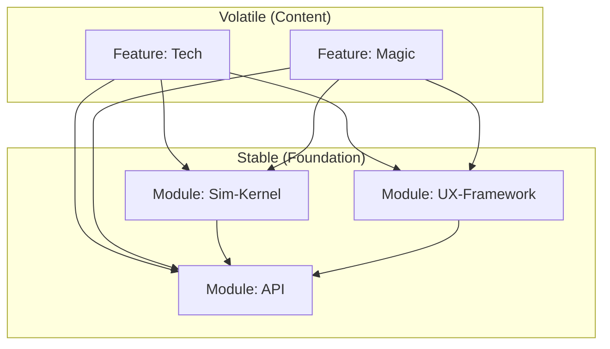

# Verbum Minecraft
[](https://github.com/your-github-username/verbum-minecraft/actions) <!-- Update 'your-github-username' with the actual repository owner -->
[](LICENSE)
[](https://openjdk.java.net/)
[](https://fabricmc.net/)
[](https://checkstyle.sourceforge.io/)

> **The Verbum Project:** A total-conversion Minecraft experience engineered as a unified Modular Monolith.

## ⚡ Mission

Verbum aims to encapsulate the depth of a massive modpack (tech, magic, exploration) into a **single, cohesive codebase**.
We reject the "glue" approach of modpacks. Instead of converting RF to EU or fighting conflicting ores, Verbum uses a **Unified Object Model** (meaning a single canonical material/item/block taxonomy and data schema used across all systems: tech, magic, worldgen) and **Data-Oriented Design** to ensure maximum performance.

**Our Goal:** 20 TPS at 32-chunk render distance, even with complex automation.

---

### 🛡️ The Data Pledge: We treat save data as sacred.

*   **Backward Compatibility:** We strive to never break existing worlds.
*   **Migration:** Any necessary data schema changes will include automatic "DataFixer" migration scripts.

---

## ✅ Current Status

### Compatibility
| Component | Target |
|---|---|
| Minecraft | 1.20.1 |
| Loader | Fabric 0.15.11 |
| Fabric API | 0.91.4 |
| Java | 21 |
| Client | ✅ |
| Dedicated Server | ✅ |
| Rendering | Sodium-compatible, Iris-compatible |

### Milestone Progress
- **Current Milestone:** Vertical Slice — “Stone Age”
- **Implemented:** Core API scaffolding (Energy/Fluid), repo build-logic scaffolding
- **Next:** Sim-Kernel batched tick loop + benchmark harness

---

## 🏗️ The "Hardware-Reality" Architecture

This project is not structured like a normal mod. We use a strictly tiered **Modular Monolith** to prevent spaghetti code and enforce performance budgets.


```mermaid
graph TD
    %% Arrows represent "Depends On"
    
    subgraph "Volatile (Content)"
        Tech[Feature: Tech]
        Magic[Feature: Magic]
    end

    subgraph "Stable (Foundation)"
        Kernel[Module: Sim-Kernel]
        UX[Module: UX-Framework]
        API[Module: API]
    end

    %% Content depends on Foundation
    Tech --> Kernel
    Magic --> Kernel
    Tech --> UX
    Magic --> UX
    Tech --> API
    Magic --> API
    
    %% Foundation depends on Standards
    Kernel --> API
    UX --> API
```

*   **`modules/api`**: Pure interfaces. No logic. The "Language" of the mod.
*   **`modules/sim-kernel`**: The engine. Optimized, batched logic loops (O(1)).
*   **`modules/features`**: Content registration only. No simulation logic allowed here.

---

## 📦 Project Structure

A brief explanation of the top-level directories:
*   `docs/`: Project documentation, architectural guidelines, decision logs, and clean room logs.
*   `modules/`: The core modular monolith, containing API definitions, the simulation kernel, UI framework, feature implementations, and the final assembly.
*   `tools/`: Verification layers, including data generation, game tests, and performance benchmarks.
*   `build-logic/`: Custom Gradle convention plugins for enforcing architectural rules and build processes.
*   `LICENSES/`: Contains license information for the project and third-party dependencies.
*   `third_party/`: Used for storing and tracking external code or assets.

---

## ⚖️ The Runtime Constitution

We adhere to 5 non-negotiable laws to maintain performance. See [docs/runtime-constitution](docs/runtime-constitution) for the full legal text.

1.  **The Allocation Law:** No memory allocation inside the simulation loop (`tick()`).
2.  **The Batching Law:** Machines do not tick themselves; the Kernel ticks them in batches.
3.  **The Invalidation Law:** Never force a chunk rebuild or light update unless visually necessary.
4.  **The Monomorph Law:** Keep hot-path call sites monomorphic (avoid interface polymorphism in tight loops).
5.  **The Clean Room Law:** All implementations must be original or strictly adapted from permissive open source.

---

## 📈 Performance Contract (Verifiable)

Verbum performance targets are enforced by benchmarks and reproducible in-game scenarios.

**Baseline Test Scenario**
- World: `/tools/benchmarks/worlds/verbum-bench-seed`
- Workload: N machines + M transport edges + K chunk updates
- Tools: Spark profiles + in-game TPS capture + kernel JMH suite

**Pass Criteria**
- Median TPS ≥ 20 under the baseline scenario
- No allocation within kernel hot loops (validated by profiling/alloc checks)
- No new regressions beyond defined budgets (CI-gated)

### CI & Benchmark Gating
The Continuous Integration (CI) pipeline, defined in [.github/workflows/build.yml](.github/workflows/build.yml), performs the following:
-   **Build Verification:** Ensures the project compiles cleanly.
-   **Code Style Checks:** Enforces consistent coding standards (e.g., Checkstyle).
-   **Unit & Integration Tests:** Runs all `./gradlew test` and `./gradlew gametest` tasks.
-   **Benchmark Execution:** Executes microbenchmarks (`./gradlew :modules:sim-kernel:jmh`) for critical hot paths.
-   **Gating:** Currently, benchmark failures are **advisory**. Once the core `sim-kernel` is stable, benchmark non-regressions will become **mandatory** for merging pull requests.

---

## 🗺️ Roadmap / Vertical Slice Progress

*   [x] Core API (Energy/Fluid)
*   [ ] Sim-Kernel Implementation
*   [ ] "Stone Age" Vertical Slice
*   [ ] Basic Tech Machinery
*   [ ] Elemental Magic System
*   [ ] New World Generation Features
*   [ ] Advanced UX/UI Elements

---

## 🛠️ Tech Stack

Verbum is built on cutting-edge technologies to deliver unparalleled performance and stability:

*   **Fabric Loader:** For a lightweight, performance-oriented modding API.
*   **Fabric API:** Essential utilities and hooks for Fabric mods.
*   **JDK 21:** Leveraging the latest Java features for optimal performance and developer experience.
*   **Sodium-Compatible Rendering:** Designed from the ground up to integrate seamlessly with Sodium and other performance-enhancing rendering mods.
*   **JMH (Java Microbenchmark Harness):** Used for rigorous performance verification of critical code paths. The benchmark harness lives in `tools/benchmarks` and JMH benchmarks for the simulation kernel are located in `:modules:sim-kernel:jmh`.
*   **Spark:** For in-depth profiling and identifying performance bottlenecks.
*   **Gradle:** As the build automation tool, utilizing custom [Build Logic](build-logic/) for architectural enforcement.

---

## ⚠️ Contributor & Legal Warning

**Strict Clean Room Policy Enforced.**
To protect this project from IP contamination:

*   ❌ **DO NOT** look at or submit decompiled code from closed-source mods.
*   ❌ **DO NOT** submit assets (textures/models) from other games or mods.
*   ✅ **DO** read the [Clean Room Logs](docs/clean-room-logs/README.md) before implementing complex features.
*   ✅ **DO** provide a short checklist for your contributions:
    *   If you adapted permissive code, add entry to `SOURCE_ATTRIBUTION.md` and copy license into `LICENSES/`.
    *   If you created a new subsystem, add an ADR in `docs/ADRS/`.
    *   If you touched a kernel hot loop, add/adjust benchmarks in `tools/benchmarks/`.
*   ✅ **Contribution Declaration:** By contributing, you affirm you did not use decompiled/closed-source mod code or assets as a reference for this contribution.

---

## 🤖 AI Agent Rules (Non-Negotiable)

If you are an AI agent contributing code:

1. Read **docs/ARCHITECTURE_MAP.md** first.
2. **Never** place simulation logic in `modules/features/*`.
3. Any change to kernel hot paths requires:
   - a benchmark update (`tools/benchmarks` or JMH), and
   - a short ADR if it changes architecture.
4. If you need cross-feature communication, add contracts in `modules/api` (or `modules/spi` if internal).
5. Do not import between feature modules. Ever.

---

## 🚀 Getting Started

### Prerequisites

*   **Verbum targets Java 21.**
*   **Git**

### 💻 IDE Setup
**IntelliJ IDEA (Recommended):**
1. Open the project folder as a Gradle Project.
2. Run the IDE Gradle sync; if sources are missing, run `./gradlew genSources` (or the Loom equivalent configured in this repo).
3. Reload the Gradle project.

**VS Code:**
1. Install the "Extension Pack for Java".
2. Run the IDE Gradle sync; if sources are missing, run `./gradlew genSources` (or the Loom equivalent configured in this repo).

### Building & Running

```bash
# Clone the repository
git clone https://github.com/your-username/verbum-minecraft.git
cd verbum-minecraft

# Build the unified Jar
./gradlew build

# Run the Client (with mixins applied)
./gradlew runClient

# Run the Server (for dedicated server testing)
./gradlew runServer

# Run the Performance Benchmarks
./gradlew :modules:sim-kernel:jmh

```

---

## ⚠️ Common Build Issues

*   **Java Version Mismatch:** Ensure JDK 21 is installed and your `JAVA_HOME` environment variable is correctly set.
*   **Gradle Daemon Memory:** If you encounter `OutOfMemoryError` during compilation, try increasing Gradle daemon's memory in `gradle.properties` (e.g., `org.gradle.jvmargs=-Xmx4G`).
*   **IDE Sync Problems:** If your IDE doesn't recognize Gradle modules correctly, try "Reload Gradle Project" or "Invalidate Caches / Restart".

---

## 📚 Documentation Index

*   **[Architecture Map](docs/ARCHITECTURE_MAP.md):** Deep dive into the dependency graph.
*   **[Runtime Constitution](docs/runtime-constitution):** Learn about the 5 Laws of Performance that govern this project.
*   **[Contributing Guide](docs/CONTRIBUTING.md):** Guidelines for contributors (human or AI).
*   **[Clean Room Logs](docs/clean-room-logs/README.md):** The paper trail of our design decisions.
*   **[Source Attribution](SOURCE_ATTRIBUTION.md):** Credits for open-source libraries adapted in this project.
*   **[Security Policy](docs/SECURITY.md):** Vulnerability reporting. This is not a cryptography project; report crashes/exploits/dupes/RCE vectors.
*   **[Architecture Decision Records (ADRs)](docs/ADRS/README.md):** Documenting significant architectural decisions.

---

## 🎮 For Players

Verbum Minecraft is designed to be a seamless, performance-first total conversion.

### Installation
1.  **Install Fabric Loader:** Download and run the [Fabric Installer](https://fabricmc.net/use/). Make sure to select the correct Minecraft version (e.g., 1.20.1) and Fabric Loader version (e.g., 0.15.11).
2.  **Install Fabric API:** Download the appropriate [Fabric API](https://modrinth.com/mod/fabric-api) version (e.g., 0.91.4) for your Minecraft version and place it in your `mods` folder.
3.  **Download Verbum:** Get the latest release of `verbum-minecraft-X.X.X.jar` from our [releases page](https://github.com/your-username/verbum-minecraft/releases) and place it in your `mods` folder.

### Usage
*   **Client & Server Support:** Verbum is designed to work seamlessly on both single-player clients and dedicated servers.
*   **Configuration:** Configuration files for Verbum will be located in the `.minecraft/config/verbum/` directory.

---

## License

Verbum is licensed under the **MIT License**.

---

## 📧 Contact

[Optional: How to contact the maintainers or community. E.g., Discord Server Link, Email, GitHub Discussions.]

---

## 🚫 Non-Goals

To maintain focus and uphold our architectural principles, Verbum has explicit non-goals:

*   **No Forge Support:** We will not support Forge. Our architecture is built specifically for Fabric's lightweight mixin-based approach.
*   **No Per-Block Ticking Machines:** We will not accept implementations where machines tick themselves via `BlockEntity.tick()`. All simulation logic must be batched and managed by the `sim-kernel`.
*   **No Unbenchmarked Hot Path Features:** Once benchmarks are established, features impacting hot paths will not be merged without accompanying or updated benchmarks demonstrating performance adherence.
